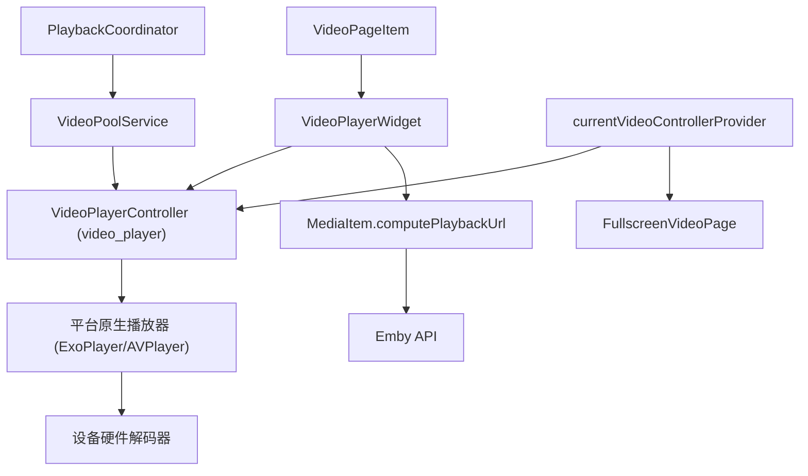
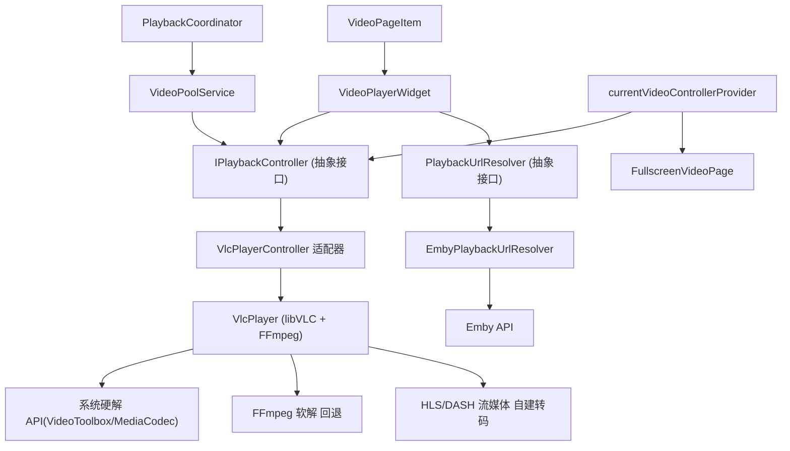
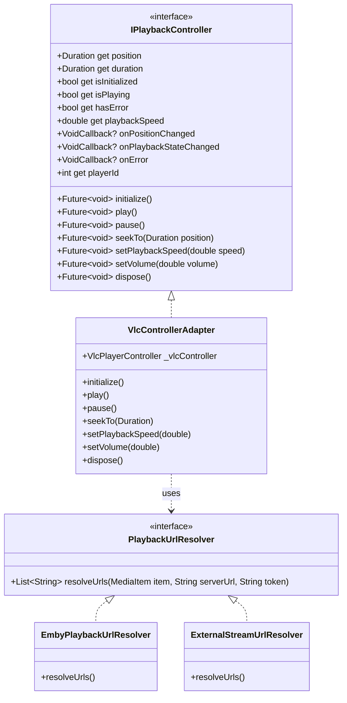

# 播放器增强

Feature Name: player-enhancement
Updated: 2026-07-24

## Description

将 EmbyTok-Flutter 的核心播放引擎从 Flutter 官方 `video_player` 插件替换为基于 libVLC 的 `flutter_vlc_player`，引入 FFmpeg 软解能力以覆盖 HEVC/H.265 解码，同时原生支持 HLS 和 DASH 流媒体协议，降低对 Emby 服务器转码的依赖。通过抽象播放控制器接口，解耦框架层与业务层的具体类型依赖，确保现有手势交互、UI 控件和字幕系统零回归。

## Architecture

### 当前架构



### 目标架构



### 抽象层设计

引入两个核心接口以解耦具体播放引擎：

1. **IPlaybackController** — 抽象播放控制器的行为接口，隔离 `video_player` 的 `VideoPlayerController` 类型
2. **PlaybackUrlResolver** — 抽象播放 URL 的构建策略，隔离 `MediaItem.computeXxxUrl()` 的 Emby 耦合



## 播放引擎选型

### 候选引擎横向对比

| 维度 | libVLC (flutter_vlc_player) | mpv (media_kit) | ExoPlayer 增强版 |
|------|---------------------------|-----------------|-----------------|
| **解码核心** | FFmpeg (完整) | FFmpeg (精简) | Android 原生 + 可选 FFmpeg 扩展 |
| **HEVC/H.265** | 硬件 + 软件自动切换 | 硬件 + 软件自动切换 | Android 依赖硬件，无软解回退 |
| **HEVC 10-bit** | 支持 | 支持 | 部分设备不支持 |
| **HLS 播放** | 成熟 (10+ 年) | 成熟 | 成熟 |
| **DASH 播放** | 成熟 | 成熟 | Android 原生支持 |
| **包体积增量** | Android ~18MB, iOS ~22MB | Android ~8MB, iOS ~10MB | Android ~3MB, iOS 需额外方案 |
| **Android 最低版本** | API 21 (Android 5.0) | API 21 | API 16 |
| **iOS 最低版本** | iOS 12 | iOS 13 | iOS 12 |
| **跨平台一致性** | 高 (同一 FFmpeg 解码链) | 高 (同一 FFmpeg 解码链) | 低 (Android/iOS 实现不同) |
| **倍速播放** | 0.25x ~ 4.0x | 0.01x ~ 100x | 0.25x ~ 2.0x |
| **音频编解码** | 全格式 (AC3/EAC3/FLAC/Opus/DTS) | 全格式 | 受限 |
| **Flutter 插件 Stars** | 1.8k+ (flutter_vlc_player) | 1.5k+ (media_kit) | N/A |
| **许可证** | LGPL v2.1 | GPL v2 | Apache 2.0 |
| **社区活跃度** | VideoLAN 组织维护, 活跃 | 个人维护 (alexmercerind), 活跃 | Google 维护 |

### 推荐选型: libVLC (flutter_vlc_player)

**推荐理由**：

1. **解码生态系统完善** — 基于 VideoLAN 组织 20+ 年积累的 libVLC 库，FFmpeg 软解作为兜底，硬件加速通过 VAAPI/VDPAU/VideoToolbox/MediaCodec 全平台覆盖
2. **Flutter 集成成熟度** — `flutter_vlc_player` 在 pub.dev 上有 95%+ 的评分，维护者对 Flutter 版本跟进及时
3. **HLS/DASH 原生支持** — VLC 的流媒体实现是行业标杆，处理自适应码率切换、分片重试、直播延迟等场景时表现稳定
4. **平台一致性好** — 所有平台共用同一 FFmpeg 解码链路，行为可预测，调试成本低
5. **倍速支持范围广** — 0.25x ~ 4.0x，覆盖项目要求的六档倍速（0.5x ~ 2.0x）并有扩展空间

**备选方案**: media_kit (mpv)，当用户对包体积极敏感时作为替代。切换成本低，因为两个方案共用同样的抽象接口。

## Components and Interfaces

### 1. IPlaybackController 抽象接口

定义位置: `/frontend/lib/services/playback/i_playback_controller.dart`

```dart
abstract class IPlaybackController {
  Future<void> initialize();
  Future<void> play();
  Future<void> pause();
  Future<void> seekTo(Duration position);
  Future<void> setPlaybackSpeed(double speed);
  Future<void> setVolume(double volume);
  Future<void> dispose();

  Duration get position;
  Duration get duration;
  bool get isInitialized;
  bool get isPlaying;
  bool get hasError;
  double get playbackSpeed;
  int get playerId; // VLC 播放器实例 ID，用于纹理渲染

  VoidCallback? onPositionChanged;
  VoidCallback? onPlaybackStateChanged;
  VoidCallback? onError;

  void addListener(VoidCallback listener);
  void removeListener(VoidCallback listener);
}
```

### 2. VlcControllerAdapter 实现

定义位置: `/frontend/lib/services/playback/vlc_controller_adapter.dart`

适配 `flutter_vlc_player` 的 `VlcPlayerController` 到 `IPlaybackController` 接口：

```dart
class VlcControllerAdapter implements IPlaybackController {
  final VlcPlayerController _vlcController;

  VlcControllerAdapter.networkUrl(String url, {Map<String, String>? httpHeaders})
    : _vlcController = VlcPlayerController.network(url,
        hwAcc: HwAcc.auto, // 自动选择硬解/软解
        options: VlcPlayerOptions(
          advanced: VlcAdvancedOptions([
            VlcAdvancedOptions.networkCaching(2000), // 2s 网络缓冲
          ]),
        ),
      );

  @override
  Future<void> initialize() => _vlcController.initialize();

  @override
  Future<void> seekTo(Duration position) => _vlcController.seekTo(position);

  @override
  Future<void> setPlaybackSpeed(double speed) => _vlcController.setPlaybackSpeed(speed);

  @override
  Future<void> dispose() async {
    await _vlcController.stop();
    _vlcController.dispose();
  }

  @override
  int get playerId => _vlcController.playerId;
  // ... 其他属性/方法委托
}
```

### 3. PlaybackUrlResolver 接口

定义位置: `/frontend/lib/services/playback/playback_url_resolver.dart`

```dart
abstract class PlaybackUrlResolver {
  List<String> resolveUrls(MediaItem item, String serverUrl, String token);
}
```

### 4. EmbyPlaybackUrlResolver 实现

```dart
class EmbyPlaybackUrlResolver implements PlaybackUrlResolver {
  @override
  List<String> resolveUrls(MediaItem item, String serverUrl, String token) {
    return [
      item.computePlaybackUrl(serverUrl, token),      // DirectPlay
      item.computeDirectStreamUrl(serverUrl, token),   // DirectStream
      item.computeHlsUrl(serverUrl, token, _sessionId), // HLS 转码
    ];
  }
}
```

### 5. 修改的核心组件

| 组件 | 当前依赖 | 修改后依赖 | 变更级别 |
|------|---------|-----------|---------|
| `VideoPlayerWidget` | `VideoPlayerController` | `IPlaybackController` | 内部重构 |
| `VideoPoolService` | `VideoPlayerController.networkUrl` | `IPlaybackController` + `ControllerFactory` | 接口化 |
| `currentVideoControllerProvider` | `StateProvider<VideoPlayerController?>` | `StateProvider<IPlaybackController?>` | 类型替换 |
| `FullscreenVideoPage` | `VideoPlayerController?` 监听 | `IPlaybackController?` 监听 | 类型替换 |
| `video_gesture_mixin.dart` | 调用 `controller.value.position` | 调用 `controller.position` | 接口适配 |
| `VideoPageItem` | `VideoPlayerController` | `IPlaybackController` | 类型替换 |
| `PlaybackCoordinator` | 不直接创建 controller | 使用 `ControllerFactory` 创建 | 新增工厂依赖 |

### 6. ControllerFactory

```dart
class ControllerFactory {
  final PlaybackUrlResolver urlResolver;

  ControllerFactory({required this.urlResolver});

  Future<IPlaybackController?> create(
    MediaItem item,
    String serverUrl,
    String token,
  ) async {
    final urls = urlResolver.resolveUrls(item, serverUrl, token);
    for (final url in urls) {
      if (url.isEmpty) continue;
      try {
        final controller = VlcControllerAdapter.networkUrl(
          url,
          httpHeaders: item.authHeaders(token),
        );
        await controller.initialize().timeout(const Duration(seconds: 12));
        return controller;
      } catch (_) {
        await controller.dispose();
      }
    }
    return null;
  }
}
```

### 7. VideoPlayerWidget 的 Texture 渲染适配

`flutter_vlc_player` 使用 Texture（外部纹理）渲染画面，不同于 `video_player` 的 `VideoPlayer` widget：

```dart
// 替换前 (video_player)
VideoPlayer(_controller)

// 替换后 (flutter_vlc_player)
VlcPlayer(
  controller: (_controller as VlcControllerAdapter).vlcController,
  aspectRatio: _aspectRatio,
  placeholder: const Center(child: CircularProgressIndicator()),
)
```

VLC 的 Texture 注册机制与 `video_player` 类似，全屏页的透明覆盖层策略可以保持不变，因为 VLC 同样支持单一 Texture 被多个 VlcPlayer widget 引用（通过 `playerId` 匹配）。

## Data Models

### DecodeCapability 枚举

```dart
enum DecodeMode {
  hardware, // GPU/专用芯片硬解
  software, // FFmpeg CPU 软解
  unknown,  // 未确定
}
```

### PlaybackSession 变更

```dart
class PlaybackSession {
  final String itemId;
  final IPlaybackController controller; // 变更: VideoPlayerController -> IPlaybackController
  final String playSessionId;
  final DateTime createdAt;
  final DecodeMode decodeMode; // 新增: 记录实际使用的解码模式

  bool get isInitialized => controller.isInitialized;
  void dispose() => controller.dispose();
}
```

### MediaSource 补充字段

在 `MediaSource` 模型中新增字段，用于解码能力判定：

```dart
class MediaSource {
  // ... 现有字段 ...
  final String? videoCodec;     // 新增: hevc / h264 / av1
  final int? videoBitDepth;     // 新增: 8 / 10
  final int? videoLevel;        // 新增: HEVC level
}
```

## Correctness Properties

### 不变量

1. **接口隔离**: 业务层代码只依赖 `IPlaybackController`，不引用任何具体播放引擎的类型
2. **单例一致性**: `currentVideoControllerProvider` 在同一时刻只持有至多一个 `IPlaybackController` 实例
3. **降级链完整性**: 三级降级链（DirectPlay → DirectStream → HLS Transcode）在 VLC 方案中保留，且每一级失败时正确释放资源

### 状态转换约束

```
[未初始化] --initialize()--> [就绪]
[就绪]    --play()---------> [播放中]
[播放中]   --pause()--------> [暂停]
[暂停]    --play()---------> [播放中]
[任意状态] --seekTo()-------> [Seek中] --完成--> [原状态]
[任意状态] --dispose()------> [已释放]
[任意状态] --错误----------> [错误状态] --dispose()--> [已释放]
```

## Error Handling

### 错误分类与处理策略

| 错误类型 | 场景 | 处理策略 |
|----------|------|---------|
| **URL 不可达** (HTTP 4xx/5xx) | Emby 服务不可用或媒体文件已删除 | 降级链下一级 → 三级全失败则展示重试 UI |
| **编码不支持** (VLC 无法解码) | 极端罕见编码格式 | 降级到 HLS Transcode（由 Emby 转码为 H264） |
| **初始化超时** (12s) | 网络极差或文件过大 | 跳过当前 URL → 降级链下一级 |
| **播放器运行时错误** | VLC 内部异常 | try-catch 捕获 → 展示错误 UI + 重试按钮 |
| **硬解失败回退** | GPU 不支持 HEVC Main10 | VLC 自动切换 FFmpeg 软解，无需应用层干预 |

### 用户可见错误 UI

```
┌──────────────────────────────────┐
│                                  │
│          ⚠ 播放失败              │
│    无法解码该视频格式或网络异常    │
│                                  │
│         [ 重试 ]  [ 反馈 ]       │
│                                  │
└──────────────────────────────────┘
```

## Test Strategy

### 单元测试

| 测试目标 | 测试内容 | 覆盖文件 |
|----------|---------|---------|
| `VlcControllerAdapter` | 接口方法委托正确性 | `vlc_controller_adapter.dart` |
| `ControllerFactory` | 降级链创建逻辑、超时处理 | `controller_factory.dart` |
| `PlaybackUrlResolver` | URL 构建正确性 | `emby_playback_url_resolver.dart` |
| `VideoPoolService` | 池满 LRU 淘汰、take/return 生命周期 | `video_pool_service.dart` |

### 组件测试

| 测试目标 | 测试内容 |
|----------|---------|
| `VideoPlayerWidget` | 正常初始化 → 播放 → 暂停 → Seek → 释放 全生命周期 |
| `VideoPageItem` | 预加载 controller 复用、全屏切换纹理保持 |
| `FullscreenVideoPage` | controller 变更监听、手势穿透 |

### 集成测试

| 测试目标 | 测试内容 |
|----------|---------|
| **HEVC/H.265 解码** | 准备 8-bit/10-bit HEVC 测试视频，验证所有平台可正常播放 |
| **HLS 流播放** | 准备多码率 HLS 流，验证自适应切换和分片重试 |
| **DASH 流播放** | 准备 MPD 格式测试流，验证基本播放能力 |
| **三级降级链** | 模拟 DirectPlay 失败 → 验证回退到 HLS |

### 性能基准

| 指标 | 目标值 | 测量方法 |
|------|--------|---------|
| 首帧渲染耗时 | < 800ms | 从 `initialize()` 调用到首帧出现的时间 |
| Seek 延迟 | < 300ms | 从 `seekTo()` 调用到画面更新的时间 |
| 倍速切换延迟 | < 200ms | `setPlaybackSpeed()` 到音频同步完成 |
| 包体积增量 | < 25MB (Android) | APK 体积对比 |

## 实施风险与缓解

| 风险 | 影响 | 缓解措施 |
|------|------|---------|
| VLC 许可证合规 (LGPL v2.1) | 法律合规 | 动态链接 libVLC，不修改源码，满足 LGPL 要求 |
| APK 体积增大 ~18MB | 用户体验 | 使用 Android App Bundle (AAB) 按需分发 .so 文件 |
| flutter_vlc_player 版本滞后 | 技术债务 | 建立 CI 定期检查上游更新；备选 media_kit 方案随时可用 |
| 视频纹理注册机制差异 | 全屏切换黑屏 | 预先验证 VLC Texture 复用行为，必要时调整透明覆盖层策略 |

## References

- Flutter VLC Player: https://pub.dev/packages/flutter_vlc_player
- libVLC 硬件加速文档: https://wiki.videolan.org/VLC_GPU_Decoding/
- media_kit (备选): https://pub.dev/packages/media_kit
- FFmpeg HEVC 解码器: https://trac.ffmpeg.org/wiki/Encode/H.265
